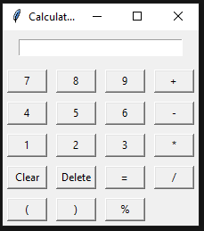

# Calculator App

A simple calculator application built using Python and Tkinter.


## Features

- Basic arithmetic operations: addition, subtraction, multiplication, and division
- Support for decimal numbers
- Parentheses for grouping expressions
- Clear and delete functionality to manage input
- Responsive GUI design

## Requirements

- Python 3.x
- Tkinter (should be available in Python standard library)

## Usage

1. Clone the repository:

   ```shell
   git clone https://github.com/your-username/calculator-app.git
   cd calculator-app
   python calculator.py


The calculator app will open in a new window. You can use the numeric buttons, arithmetic operation buttons, and other control buttons to input and calculate expressions.

License
This project is licensed under the MIT License.

Acknowledgements
Tkinter Documentation - Official documentation for the Tkinter library.
Contributing
Contributions are welcome! If you find any bugs or want to add new features, please feel free to open an issue or submit a pull request.

Fork the project
Create your feature branch (git checkout -b feature/your-feature)
Commit your changes (git commit -am 'Add some feature')
Push to the branch (git push origin feature/your-feature)
Open a pull request

## Author

###Beexoul

## Contact
For any inquiries or questions, you can reach me at student.shivarajpaudel@gmail.com.

```shell
Feel free to modify and customize the contents of the `README.md` file to suit your specific project requirements.


